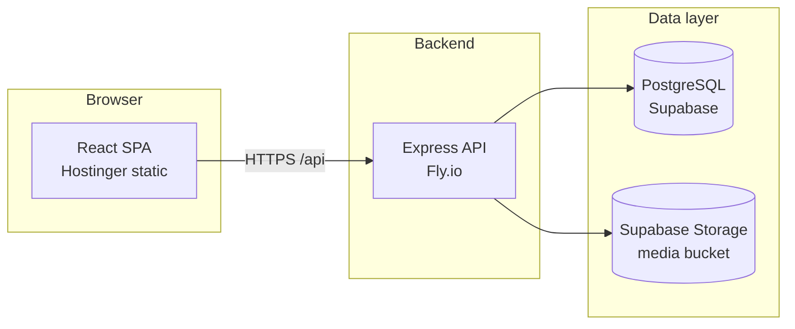

# Quran Journey Academy — Full Stack LMS

Production-ready **Learning Management System** for [Quran Journey Academy](https://quranjourney.academy): a public marketing site, role-based dashboards, course and session management, payments, blog CMS, lead capture, and a **no-code Site Editor** for page copy and media — all backed by a Node.js API and PostgreSQL.

---

## What this project does

| Area | Capabilities |
|------|----------------|
| **Public website** | Home, Courses, Pricing, Blog, About, Contact, Feedback — content driven from the database via the Site Editor |
| **Admin dashboard** | Students, teachers, courses, 1-on-1 sessions, payments, blog, form submissions, testimonials, media library, site-wide content editor |
| **Teacher dashboard** | View and manage assigned sessions |
| **Student dashboard** | View enrolled sessions and account info |
| **Integrations** | JWT auth, EmailJS (and optional SMTP), Telegram / WhatsApp notifications, Supabase Storage for persistent uploads |

Three roles share one auth system: **admin**, **teacher**, **student**.

---

## Architecture



| Layer | Technology | Production hosting |
|-------|------------|-------------------|
| Frontend | React 18, React Router, Tailwind-style CSS, Recharts | **Hostinger** (`public_html` + `.htaccess` for SPA routing) |
| Backend | Node.js, Express, JWT, bcrypt, Helmet, rate limiting | **Fly.io** (`quran-journey-backend`) |
| Database | PostgreSQL 14+ with versioned SQL migrations | **Supabase Postgres** |
| Media | Local disk in dev; Supabase Storage in prod | **Supabase** public `media` bucket |

Detailed production steps: **[DEPLOY.md](./DEPLOY.md)**  
Database workflow: **[MIGRATION_GUIDE.md](./MIGRATION_GUIDE.md)**

---

## Repository layout

```
quran-journey-lms/
├── backend/                 # Express REST API
│   ├── src/
│   │   ├── config/          # DB, email, storage (Supabase), notifications
│   │   ├── controllers/
│   │   ├── middleware/      # Auth, validation, errors
│   │   └── routes/
│   ├── migrations/          # Ordered .sql files + run.js tracker
│   ├── seeds/               # Demo users, courses, blog, site content
│   ├── fly.toml             # Fly.io app config
│   └── .env.example
├── frontend/                # Create React App
│   ├── src/pages/
│   │   ├── public/          # Marketing pages
│   │   ├── admin/           # Admin CRUD + Site Editor + Media
│   │   ├── student/
│   │   └── teacher/
│   └── public/.htaccess     # SPA fallback for Hostinger
├── DEPLOY.md                # Fly + Supabase + Hostinger guide
├── MIGRATION_GUIDE.md       # How migrations work
└── check-ready.js           # Pre-deploy sanity check
```

---

## How it works

### Authentication & authorization

1. User logs in via `POST /api/auth/login` → receives a JWT.
2. Frontend stores the token and sends `Authorization: Bearer <token>` on protected routes.
3. Middleware enforces **role-based access** (`admin`, `teacher`, `student`) per endpoint.
4. Passwords are hashed with **bcrypt** (12 rounds).

### Database migrations

Migrations are plain SQL files in `backend/migrations/`, applied in filename order:

| File | Purpose |
|------|---------|
| `001_initial_schema.sql` | Core tables: users, students, teachers, courses, sessions, enrollments, payments, blog, form_submissions, site_settings |
| `002_updates.sql` | Schema extensions (testimonials, site_content, media, etc.) |
| `003_full_site_content.sql` | Seeds editable content blocks for all public pages |
| `004_hero_image.sql` | Hero image fields |
| `005_user_country.sql` | User country field |

A `_migrations` table records applied files. **`npm run migrate` only runs pending files** — safe to run on every deploy.

```bash
cd backend
npm run migrate    # apply pending SQL only
npm run seed       # sample content + local-only demo users (idempotent)
npm run setup      # migrate + seed (first-time local setup)
```

On Fly.io after deploy:

```bash
fly ssh console -a quran-journey-backend -C "cd /app && npm run migrate"
```

### Site content & media

- **`site_content`** — key/value blocks per page/section (edited in **Admin → Site Editor**).
- **`site_settings`** — global key/value config.
- **Media library** uploads to local `backend/uploads/` in development, or **Supabase Storage** when `SUPABASE_URL` + service role key are set (recommended in production so files survive Fly machine restarts).

### API surface

Base path: `/api` — health check at `GET /api/health`.

| Module | Routes | Notes |
|--------|--------|-------|
| Auth | `/auth` | login, register, me, password |
| Users | `/users` | Admin: CRUD students/teachers |
| Courses | `/courses` | Public list; admin write |
| Sessions | `/sessions` | Filtered by role |
| Blog | `/blog` | Public read; admin write |
| Submissions | `/submissions` | Public contact form; admin inbox |
| Payments | `/payments` | Admin payment tracking |
| Analytics | `/analytics` | Admin dashboard stats |
| Testimonials | `/testimonials` | Public + admin |
| Site content | `/site-content` | CMS blocks for Site Editor |
| Media | `/media` | Upload/list/delete assets |

---

## Local development

### Prerequisites

- Node.js 18+
- PostgreSQL 14+ (or Supabase connection string)
- npm

### 1. Install dependencies

```bash
cd backend && npm install
cd ../frontend && npm install
```

### 2. Configure backend

```bash
cd backend
cp .env.example .env
```

Set at minimum: `DATABASE_URL` (or `DB_*`), `JWT_SECRET`, `FRONTEND_URL`, and optional EmailJS / Supabase keys (see `.env.example`).

### 3. Create database & run setup

```bash
# PostgreSQL
psql -U postgres -c "CREATE DATABASE quran_journey_lms"

cd backend
npm run setup
```

### 4. Run dev servers

```bash
# Terminal 1 — API (default port 5000 locally, 8080 on Fly)
cd backend && npm run dev

# Terminal 2 — React (http://localhost:3000, proxies API in dev)
cd frontend && npm start
```

### Local demo accounts (after `npm run setup`)

Demo users are created **only in local development** (`NODE_ENV` ≠ `production`). Passwords are **not** stored in this repository.

1. Run `npm run setup` in `backend/`.
2. Check the terminal output for emails and passwords (or set `SEED_*_EMAIL` / `SEED_*_PASSWORD` in `.env` — see `backend/.env.example`).
3. For production, create your own admin and rotate all secrets — see **[SECURITY.md](./SECURITY.md)**.

---

## Production deployment (summary)

This repo is configured for:

1. **Backend** → `fly deploy` from `backend/` (see `fly.toml`)
2. **Database** → Supabase Postgres + `npm run migrate` on the live DB
3. **Storage** → Supabase public bucket `media`
4. **Frontend** → `npm run build` in `frontend/`, upload `build/` contents to Hostinger `public_html`

Set Fly secrets (`DATABASE_URL`, `JWT_SECRET`, `FRONTEND_URLS`, EmailJS, Supabase, etc.) as documented in **[DEPLOY.md](./DEPLOY.md)**.

Frontend production env:

```env
REACT_APP_API_URL=https://quran-journey-backend.fly.dev/api
```

(Use your custom API domain if configured.)

---

## Security

See **[SECURITY.md](./SECURITY.md)** for production handoff, credential rotation, and first admin setup.

- JWT with configurable expiry
- Helmet security headers
- Rate limiting (general API + stricter auth endpoints)
- CORS locked to `FRONTEND_URL` / `FRONTEND_URLS`
- Parameterized SQL queries (pg)
- Input validation via express-validator
- Fly-aware client IP for rate limits (`fly-client-ip`)

---

## Design system

| Token | Hex | Usage |
|-------|-----|--------|
| Primary | `#033455` | Brand, buttons, headings |
| Secondary | `#4C4C4C` | Body text |
| Accent | `#C9A84C` | Highlights |

**Fonts:** Playfair Display (headings), Nunito (UI), Amiri (Arabic)

---

## Extending the project

**New admin page:** add `frontend/src/pages/admin/...`, route in `App.js`, nav item in `DashboardLayout.js`.

**New API endpoint:** controller → route → register in `backend/src/index.js`.

**New DB change:** add `006_description.sql` (idempotent SQL) → `npm run migrate`. See [MIGRATION_GUIDE.md](./MIGRATION_GUIDE.md).

---

## Tech stack

- **Frontend:** React 18, React Router v6, Axios, react-hot-toast, Headless UI, Heroicons, Recharts
- **Backend:** Express 4, pg, jsonwebtoken, bcryptjs, multer, nodemailer
- **Database:** PostgreSQL with uuid-ossp / pgcrypto
- **Deploy:** Fly.io, Supabase, Hostinger, Docker (`backend/Dockerfile`), optional Render/Railway configs

---

## Contact

- Website: [quranjourney.academy](https://quranjourney.academy)
- Email: info@quranjourney.com
- WhatsApp: +20 150 801 8609

---

## License

Private / client project — all rights reserved unless otherwise specified by the repository owner.
